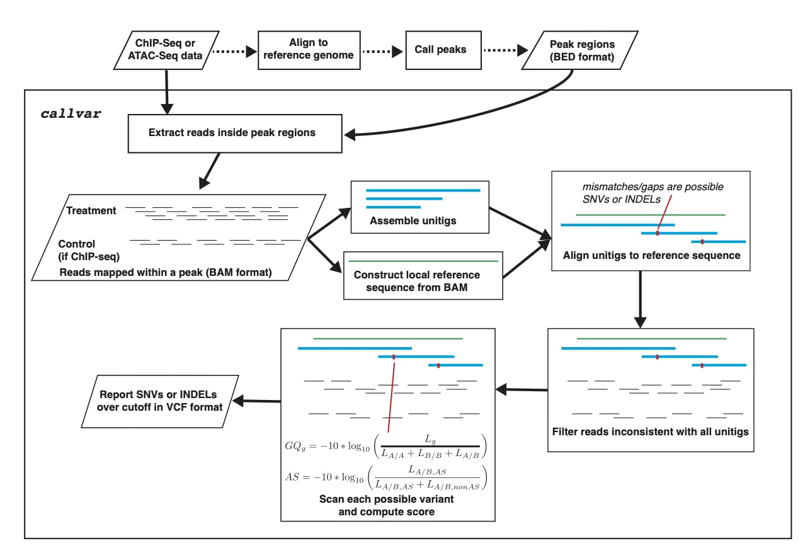

# Call variants

This function in MACS3 can be used to **directly** call genetics
variants and infer allele specific events from the BAM files inside
the ChIP-seq or ATAC-seq peaks, without the need of deep whole genome
sequencing. It can be invoked by `macs3 callvar` . The method was
previously implemented in a separate project named
[`SAPPER`](https://github.com/taoliu/SAPPER). The MACS3 port of SAPPER
has been modified to directly work on the BAM files people usually use
for peak calling. However, since `callvar` will randomly access chunks
of alignments within given peaks, the BAM files as input to`callvar`
have to be sorted by coordinates and indexed through `samtools`. In
another word, the `.bai` files are required together with the `.bam`
files.

## Algorithm

Targeted DNA assays such as ChIP-Seq or ATAC-seq provide high coverage
at functional regulatory elements where proteins interact with DNA, we
built this `callvar` algorithm based on the hypothesis that the DNA
sequences at the targeted regulatory elements can be piled up or
assembled ( into ‘unitigs’ ) for predicting SNV and short INDELs and
infering allele specific events.

### Workflow of `callvar`




## Usage

### Common usage

In general, user has to provide 1 BAM file from targeted DNA
sequencing assay (ChIP-seq or ATAC-seq) `TREAT_sorted.bam`, and 1 BED
file for regions of interest (i.e. peak regions)
`peaks.bed`. Optionally, user can also provide a BAM file from a
matching unbiased control sample, i.e. genomic input, or igg control
`CTRL_sorted.bam`. The idea is that the BAM file from targeted DNA
assay may have allele specific biases, whereas the control sample
doesn't.  The typical command is

```
$ macs3 callvar -b peaks.bed -t TREAT_sorted.bam -c CTRL_sorted.bam -o peaks.vcf
```

The result of variants in peaks, and allele specific events can be found in the `peaks.vcf` file.

### Prepare Input Files

The input files in BAM format should be sorted and indexed. You can use `samtools`:

```
$ samtools sort -o sorted.bam original.bam
$ samtools index -b sorted.bam
```

### Essential options

#### Region of interest in BED format `-b`

You can specify the regions you plan to call variants from. Usually,
it should be the peak file (narrowPeak or any BED format) from
MACS. REQUIRED.

#### Treatment file in sorted BAM `-t`

ChIP-seq/ATAC-seq treatment file in BAM format, sorted by
coordinates. Make sure the `.bai` file is avaiable in the same
directory. REQUIRED.

#### Optional `-c CFILE`

Optional control file in BAM format, sorted by coordinates. Make sure
the `.bai` file is avaiable in the same directory. When the control
file is provided, MACS3 will consider that the allelic bias in control
should be close to 1 (i.e. unbiased) whereas the allelic enrichment in
treatment can be biased. If available, a low-depth (or even
high-depth) whole genome sequencing libary can be used as control (or
genomic input).

#### Output directory and output filename `--outdir` and required `-o`

You can let MACS3 write all output files in a specific directory by
using `--outdir`. You can also specify the output file name through
`-o`. The `-o` option is REQUIRED.

#### Cutoff for calling heterozygous allele `-g`

You can also use `--gq-hetero`. This option specifies the Genotype
Quality (GQ) score `(-10log10((L00+L11)/(L01+L00+L11)))` cutoff for
Heterozygous allele type. Default is 0, or there is no cutoff on
GQ. You can set a high value to keep more confident Heterozygous
Alleles, however, you can also keep the default and filter the result
later.

#### Cutoff for calling homozygous allele (different with reference allele) `-G`

You can also use `--gq-homo`. This option specifies the Genotype
Quality (GQ) score (-10log10(L01/(L01+L00+L11))) cutoff for Homozygous
allele (not the same as reference) type. Default is 0, or there is no
cutoff on GQ. You can set a high value to keep more confident
Homozygous Alleles, however, you can also keep the default and filter
the result later.

#### Controling when to use assembler `fermi-lite` `-F`

This is an option to control when to apply local assembly through
[`fermi-lite`](https://github.com/lh3/fermi-lite). By default (set as
'auto'), while MACS3 detects any INDEL in a peak region, it will
utilize `fermi-lite` to recover the actual DNA sequences to refine the
read alignments. However it won't be invoked while MACS3 detects an
SNV. If set as 'on', `fermi` will be always called on SNV or INDEL. It
can increase specificity however sensivity and speed will be
significantly lower. If set as 'off', `fermi` won't be invoked at
all. If so, speed and sensitivity can be higher but specificity will
be significantly lower. Default is 'auto'.

#### The option for `fermi-lite` assembler `--fermi-overlap`

The minimal overlap for fermi to initially assemble two reads. Must be
between 1 and read length. Suggested value: 30 for 36bp read, 33 for
100bp read. Default:33

#### Quality control threshold for calling variants `--top2alleles-mratio` `--altallele-count` and `--max-ar`

There are three thresholds for controlling the quality of the alleles
called from `callvar`.

The first option is the `--min-top2ratio` or the "minimal ratio
of the top 2 alleles". The reads for the top 2 most frequent alleles
(e.g. a reference allele and an alternative allele) at a loci
shouldn't be too few comparing to total reads mapped. The minimum
ratio is set by this optoin. Must be a float between 0.5
and 1. Default is 0.8 which means at least 80%% of reads contain the
top 2 alleles. If there are more than 2 possible alleles, only the top
2 will be considered.

Secondly, we can set the minimum count of the alternative
(non-reference) allele at a loci with `--min-altcount`, so that it
shouldn't be too few. By default, we require at least two reads
supporting the alternative allele. Default is 2.

Lastly, the maximum Allele-Ratio (AR) allowed while calculating
likelihood for allele-specific binding can be set through
`--max-ar`. If we allow higher maximum AR, we may mistakenly assign
some "bound homozygous loci" as "heterozygous loci with allele
specific binding". Or in another word, we assume that the extreme
biased enrichment on the alleles are rare. Default is 0.95

### Interpret Output file

Currently, the output from `callvar` is in VCF v4.1 format. The meta information contains the following lines:

1. format line:
   
   ```
   ##fileformat=VCFv4.1
   ```

2. Date when writing the file

   ```
   ##fileDate=YYYYMMDD
   ```

3. MACS3 version and command line
   
   ```
   ##source=MACS_V3.X.XXX
   ##Program_Args=callvar ...
   ```
   Note that MACS3 will write all parameters, including the default parameters, in the `Program_Args`.

4. INFO lines:
   - Allele binding model selected by MACS3. It could be: `homo`,
	 `heter_AS`, `heter_noAS`, or `heter_unsure`, representing
	 homozygous loci, heterozygous loci with allele specific enrichment,
	 heterozygous loci with non-alelle-specific enrichment, or
	 heterzygous loci with unsure allele bias.

	 ```
	 ##INFO=<ID=M,Number=.,Type=String,Description="MACS Model with minimum BIC value: homo, heter_AS, heter_noAS, heter_unsure">
	 ```
 
   - Variant type. It could be either `SNV` for single-nucleotide
	 variant, `Insertion` for small insertion, or `Deletion` for small
	 deletion.
   
     ```
	 ##INFO=<ID=MT,Number=.,Type=String,Description="Mutation type: SNV/Insertion/Deletion">
	 ```
   
   - Sequencing depth in the treatment and control files
   
     ```
	 ##INFO=<ID=DPT,Number=1,Type=Integer,Description="Depth Treatment: Read depth in treatment data">
	 ##INFO=<ID=DPC,Number=1,Type=Integer,Description="Depth Control: Read depth in control data">
	 ```
   
   - Read depth of the top1 and top2 alleles in treatment and control
 
     ```
	 ##INFO=<ID=DP1T,Number=.,Type=String,Description="Read depth of top1 allele in treatment data">
	 ##INFO=<ID=DP2T,Number=.,Type=String,Description="Read depth of top2 allele in treatment data">
	 ##INFO=<ID=DP1C,Number=.,Type=String,Description="Read depth of top1 allele in control data">
	 ##INFO=<ID=DP2C,Number=.,Type=String,Description="Read depth of top2 allele in control data">
	 ```
   
   - Difference of BIC of the selected model and the second best model. The difference is bigger the better.
 
	 ```
	 ##INFO=<ID=DBIC,Number=.,Type=Float,Description="Difference of BIC of selected model vs second best alternative model">
	 ```
   
   - BIC scores of the four models -- homozygous with major allele bound, homozygous with minor allele bound, heterozygous with no allele-specific binding, and heterozygous with allele-specific binding.
 
	 ```
	 ##INFO=<ID=BICHOMOMAJOR,Number=1,Type=Integer,Description="BIC of homozygous with major allele model">
	 ##INFO=<ID=BICHOMOMINOR,Number=1,Type=Integer,Description="BIC of homozygous with minor allele model">
	 ##INFO=<ID=BICHETERNOAS,Number=1,Type=Integer,Description="BIC of heterozygous with no allele-specific model">
	 ##INFO=<ID=BICHETERAS,Number=1,Type=Integer,Description="BIC of heterozygous with allele-specific model">
	 ```

   - Allele Ratio for heterzygous allele
   
     ```
	 ##INFO=<ID=AR,Number=1,Type=Float,Description="Estimated allele ratio of heterozygous with allele-specific model">
	 ```

5. FORMAT lines:
   
   Include the Genotype: "0/0", "1/1", or "0/1"; the read depth after filtering at 0 (reference) and 1 (alternative) allele; the genotype quality score; and three normalized Phred-scaled genotype likelihoods for 0/0, 0/1, and 1/1 genotype.
   
   ```
   ##FORMAT=<ID=GT,Number=1,Type=String,Description="Genotype">
   ##FORMAT=<ID=DP,Number=1,Type=Integer,Description="Read depth after filtering bad reads">
   ##FORMAT=<ID=GQ,Number=1,Type=Integer,Description="Genotype Quality score">
   ##FORMAT=<ID=PL,Number=3,Type=Integer,Description="Normalized, Phred-scaled genotype likelihoods for 00, 01, 11 genotype">
   ```

#### Example of output:

```
##fileformat=VCFv4.1
##fileDate=20210310
##source=MACS_V3.0.0a6
##Program_Args=callvar -b callvar_testing.narrowPeak -t CTCF_PE_ChIP_chr22_50k.bam -c CTCF_PE_CTRL_chr22_50k.bam -o ../temp/test_run_callvar/PEsample.vcf -Q 20 -D 1 --max-ar 0.95 --top2alleles-mratio 0.8 --top2allele-count 2 -g 0 -G 0  --fermi auto --fermi-overlap 30
##INFO=<ID=M,Number=.,Type=String,Description="MACS Model with minimum BIC value">
##INFO=<ID=MT,Number=.,Type=String,Description="Mutation type: SNV/Insertion/Deletion">
##INFO=<ID=DPT,Number=1,Type=Integer,Description="Depth Treatment: Read depth in ChIP-seq data">
##INFO=<ID=DPC,Number=1,Type=Integer,Description="Depth Control: Read depth in control data">
##INFO=<ID=DP1T,Number=.,Type=String,Description="Read depth of top1 allele in ChIP-seq data">
##INFO=<ID=DP2T,Number=.,Type=String,Description="Read depth of top2 allele in ChIP-seq data">
##INFO=<ID=DP1C,Number=.,Type=String,Description="Read depth of top1 allele in control data">
##INFO=<ID=DP2C,Number=.,Type=String,Description="Read depth of top2 allele in control data">
##INFO=<ID=DBIC,Number=.,Type=Float,Description="Difference of BIC of selected model vs second best alternative model">
##INFO=<ID=BICHOMOMAJOR,Number=1,Type=Integer,Description="BIC of homozygous with major allele model">
##INFO=<ID=BICHOMOMINOR,Number=1,Type=Integer,Description="BIC of homozygous with minor allele model">
##INFO=<ID=BICHETERNOAS,Number=1,Type=Integer,Description="BIC of heterozygous with no allele-specific model">
##INFO=<ID=BICHETERAS,Number=1,Type=Integer,Description="BIC of heterozygous with allele-specific model">
##INFO=<ID=AR,Number=1,Type=Float,Description="Estimated allele ratio of heterozygous with allele-specific model">
##FORMAT=<ID=GT,Number=1,Type=String,Description="Genotype">
##FORMAT=<ID=DP,Number=1,Type=Integer,Description="Read depth after filtering bad reads">
##FORMAT=<ID=GQ,Number=1,Type=Integer,Description="Genotype Quality score">
##FORMAT=<ID=PL,Number=3,Type=Integer,Description="Normalized, Phred-scaled genotype likelihoods for 00, 01, 11 genotype">
##contig=<ID=chr1,length=249250621,assembly=NA>
##contig=<ID=chr2,length=243199373,assembly=NA>
##contig=<ID=chr3,length=198022430,assembly=NA>
##contig=<ID=chr4,length=191154276,assembly=NA>
##contig=<ID=chr5,length=180915260,assembly=NA>
##contig=<ID=chr6,length=171115067,assembly=NA>
##contig=<ID=chr7,length=159138663,assembly=NA>
##contig=<ID=chr8,length=146364022,assembly=NA>
##contig=<ID=chr9,length=141213431,assembly=NA>
##contig=<ID=chr10,length=135534747,assembly=NA>
##contig=<ID=chr11,length=135006516,assembly=NA>
##contig=<ID=chr12,length=133851895,assembly=NA>
##contig=<ID=chr13,length=115169878,assembly=NA>
##contig=<ID=chr14,length=107349540,assembly=NA>
##contig=<ID=chr15,length=102531392,assembly=NA>
##contig=<ID=chr16,length=90354753,assembly=NA>
##contig=<ID=chr17,length=81195210,assembly=NA>
##contig=<ID=chr18,length=78077248,assembly=NA>
##contig=<ID=chr19,length=59128983,assembly=NA>
##contig=<ID=chr20,length=63025520,assembly=NA>
##contig=<ID=chr21,length=48129895,assembly=NA>
##contig=<ID=chr22,length=51304566,assembly=NA>
##contig=<ID=chrX,length=155270560,assembly=NA>
##contig=<ID=chrY,length=59373566,assembly=NA>
#CHROM	POS	ID	REF	ALT	QUAL	FILTER	INFO	FORMAT	SAMPLE
chr22	17255752	.	A	G	58	.	M=heter_unsure;MT=SNV;DPT=7;DPC=0;DP1T=5A;DP2T=2G;DP1C=0A;DP2C=0G;SB=0,0,5,2;DBIC=23.21;BICHOMOMAJOR=37.77;BICHOMOMINOR=84.27;BICHETERNOAS=13.53;BICHETERAS=14.56;AR=0.71	GT:DP:GQ:PL	0/1:7:58:159,0,58
chr22	17373009	.	A	C	103	.	M=heter_unsure;MT=SNV;DPT=14;DPC=0;DP1T=10C;DP2T=4A;DP1C=0C;DP2C=0A;SB=6,2,4,2;DBIC=42.28;BICHOMOMAJOR=67.24;BICHOMOMINOR=172.70;BICHETERNOAS=23.92;BICHETERAS=24.96;AR=0.71	GT:DP:GQ:PL	0/1:14:103:332,0,103
chr22	17373045	.	C	A	86	.	M=heter_unsure;MT=SNV;DPT=21;DPC=0;DP1T=17C;DP2T=4A;DP1C=0C;DP2C=0A;SB=5,2,12,2;DBIC=32.16;BICHOMOMAJOR=63.56;BICHOMOMINOR=286.44;BICHETERNOAS=31.41;BICHETERAS=29.59;AR=0.81	GT:DP:GQ:PL	0/1:21:86:570,0,86
chr22	17373048	.	G	T	91	.	M=heter_unsure;MT=SNV;DPT=20;DPC=0;DP1T=16G;DP2T=4T;DP1C=0G;DP2C=0T;SB=4,2,12,2;DBIC=35.01;BICHOMOMAJOR=65.40;BICHOMOMINOR=276.31;BICHETERNOAS=30.39;BICHETERAS=29.05;AR=0.80	GT:DP:GQ:PL	0/1:20:91:549,0,91
chr22	17392522	.	G	A	163	.	M=heter_unsure;MT=SNV;DPT=17;DPC=1;DP1T=12A;DP2T=5G;DP1C=0A;DP2C=1G;SB=0,2,12,3;DBIC=69.61;BICHOMOMAJOR=100.40;BICHOMOMINOR=195.26;BICHETERNOAS=29.65;BICHETERAS=30.79;AR=0.71	GT:DP:GQ:PL	0/1:18:163:369,0,163
chr22	17392539	.	G	C	138	.	M=heter_noAS;MT=SNV;DPT=13;DPC=0;DP1T=7C;DP2T=6G;DP1C=0C;DP2C=0G;SB=0,1,7,5;DBIC=61.11;BICHOMOMAJOR=84.75;BICHOMOMINOR=101.33;BICHETERNOAS=23.63;BICHETERAS=26.12;AR=0.54	GT:DP:GQ:PL	0/1:13:138:174,0,138
chr22	17392546	.	T	TA	99	.	M=heter_unsure;MT=Insertion;DPT=12;DPC=0;DP1T=8T;DP2T=4TA;DP1C=0T;DP2C=0TA;SB=1,0,7,4;DBIC=40.91;BICHOMOMAJOR=64.03;BICHOMOMINOR=121.12;BICHETERNOAS=21.40;BICHETERAS=23.12;AR=0.67	GT:DP:GQ:PL	0/1:12:99:223,0,99
chr22	17392558	.	T	A	121	.	M=heter_unsure;MT=SNV;DPT=14;DPC=0;DP1T=10T;DP2T=4A;DP1C=0T;DP2C=0A;SB=0,0,10,4;DBIC=50.56;BICHOMOMAJOR=75.53;BICHOMOMINOR=179.60;BICHETERNOAS=23.92;BICHETERAS=24.96;AR=0.71	GT:DP:GQ:PL	0/1:14:121:347,0,121
chr22	17392597	.	T	TA	24	.	M=heter_unsure;MT=Insertion;DPT=5;DPC=0;DP1T=4T;DP2T=1TA;DP1C=0T;DP2C=0TA;SB=0,0,4,1;DBIC=7.95;BICHOMOMAJOR=17.96;BICHOMOMINOR=70.46;BICHETERNOAS=9.86;BICHETERAS=10.01;AR=0.80	GT:DP:GQ:PL	0/1:5:24:138,0,24
chr22	17398508	.	T	C	407	.	M=heter_noAS;MT=SNV;DPT=33;DPC=1;DP1T=19C;DP2T=14T;DP1C=0C;DP2C=1T;SB=7,8,12,6;DBIC=184.34;BICHOMOMAJOR=238.56;BICHOMOMINOR=307.64;BICHETERNOAS=54.22;BICHETERAS=57.31;AR=0.58	GT:DP:GQ:PL	0/1:34:407:557,0,407
chr22	17652406	.	T	C	189	.	M=heter_unsure;MT=SNV;DPT=15;DPC=3;DP1T=10T;DP2T=5C;DP1C=0T;DP2C=3C;SB=5,3,5,2;DBIC=80.91;BICHOMOMAJOR=113.77;BICHOMOMINOR=148.32;BICHETERNOAS=31.12;BICHETERAS=32.87;AR=0.67	GT:DP:GQ:PL	0/1:18:189:264,0,189
chr22	17652461	.	G	A	287	.	M=heter_noAS;MT=SNV;DPT=19;DPC=2;DP1T=11G;DP2T=8A;DP1C=0G;DP2C=2A;SB=7,5,4,3;DBIC=128.91;BICHOMOMAJOR=164.87;BICHOMOMINOR=181.45;BICHETERNOAS=35.96;BICHETERAS=38.62;AR=0.58	GT:DP:GQ:PL	0/1:21:287:323,0,287
chr22	17653030	.	T	C	238	.	M=heter_noAS;MT=SNV;DPT=17;DPC=1;DP1T=9T;DP2T=8C;DP1C=1T;DP2C=0C;SB=2,0,7,8;DBIC=107.07;BICHOMOMAJOR=138.17;BICHOMOMINOR=164.41;BICHETERNOAS=31.10;BICHETERAS=33.87;AR=0.53	GT:DP:GQ:PL	0/1:18:238:295,0,238
chr22	17652406	.	T	C	189	.	M=heter_unsure;MT=SNV;DPT=15;DPC=3;DP1T=10T;DP2T=5C;DP1C=0T;DP2C=3C;SB=5,3,5,2;DBIC=80.91;BICHOMOMAJOR=113.77;BICHOMOMINOR=148.32;BICHETERNOAS=31.12;BICHETERAS=32.87;AR=0.67	GT:DP:GQ:PL	0/1:18:189:264,0,189
chr22	17652461	.	G	A	287	.	M=heter_noAS;MT=SNV;DPT=19;DPC=2;DP1T=11G;DP2T=8A;DP1C=0G;DP2C=2A;SB=7,5,4,3;DBIC=128.91;BICHOMOMAJOR=164.87;BICHOMOMINOR=181.45;BICHETERNOAS=35.96;BICHETERAS=38.62;AR=0.58	GT:DP:GQ:PL	0/1:21:287:323,0,287
chr22	17653030	.	T	C	238	.	M=heter_noAS;MT=SNV;DPT=17;DPC=1;DP1T=9T;DP2T=8C;DP1C=1T;DP2C=0C;SB=2,0,7,8;DBIC=107.07;BICHOMOMAJOR=138.17;BICHOMOMINOR=164.41;BICHETERNOAS=31.10;BICHETERAS=33.87;AR=0.53	GT:DP:GQ:PL	0/1:18:238:295,0,238
```
